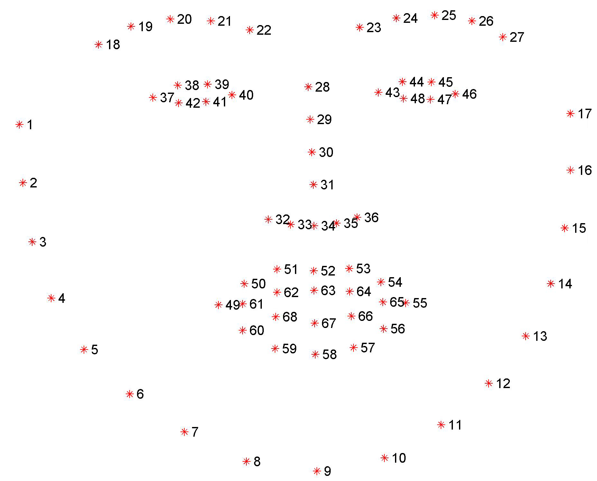

# Facial-KeyPoints-Detection
Applied image processing techniques and deep learning techniques to detect faces in an image and find facial keypoints. Facial keypoints include points around the eyes, nose, and mouth on a face and are used in many applications. These applications include: facial tracking, facial pose recognition, facial filters, emotion recognition etc.

## Objective
The objective is to predict keypoint positions on face images. This can be used as a building block in several applications such as tracking faces in images and videos, analysing facial expressions, biometrics / face recognition and so on.
This project is well known as [Kaggle challenge](https://www.kaggle.com/c/facial-keypoints-detection)
> "Detecing facial keypoints is a very challenging problem.  Facial features vary greatly from one individual to another, and even for a single individual, there is a large amount of variation due to 3D pose, size, position, viewing angle, and illumination conditions. Computer vision research has come a long way in addressing these difficulties, but there remain many opportunities for improvement."


## Project Goal 
The project goal is to combine computer vision techniques and deep learning architectures to build a facial keypoint detection system that takes in any image with faces, and predicts the location of 68 distinguishing key points on each face. 
* image processing and feature extraction techniques to programmatically represent different facial features
* deep learning techniques to program a convolutional neural network to recognize facial keypoints

## Implementation Approach
### DATA 
This set of image data has been extracted from the YouTube Faces Dataset, which includes videos of people in [YouTube videos](https://www.cs.tau.ac.il/~wolf/ytfaces/). These videos have been fed through some processing steps and turned into sets of image frames containing one face and the associated keypoints.
Facial keypoints (also called facial landmarks) are represented by 68 keypoints in a single face, with coordinates (x, y), for that face. These keypoints mark important areas of the face: the eyes, corners of the mouth, the nose, like the image below etc. These keypoints are relevant for a variety of tasks, such as face filters, emotion recognition, pose recognition, and so on. Here they are, numbered, are arranged and matched to represent different portions of the face.

The original set of face image data was extracted from the YouTube Faces Dataset, and the facial keypoints dataset consists of 5770 color images. All of these images are summarized in CSV files which include keypoint's (x,y) coordinates
* training data set: 3462 images' keypoints
* testing data set: 2308 images' keypoints

### Data Processing
All images are not of the same size, and neural networks often expect images that are standardized; a fixed size, with a normalized range for color ranges and coordinates, and (for PyTorch) converted from numpy lists and arrays to Tensors. Applied PyTorch's Data_transform to turn an input image that rescales, grayscale random crop, normalizes and turns the images into torch Tensors.
* Normalize: to convert a color image to grayscale values with a range of [0,1] and normalize the keypoints to be in a range of about [-1, 1]
* Rescale: to rescale an image to a desired size.
* RandomCrop: to crop an image randomly.
* ToTensor: to convert numpy images to torch images.
```python
data_transform = transforms.Compose([Rescale(250),
                                     RandomCrop(224),
                                     Normalize(),
                                     ToTensor()])
```

*further data augmentation to explore*
Randomly rotating and/or flipping the images in the dataset


### Build Neural Network 
To define a neural network in PyTorch, I need to define the layers of a model in the function __init__ and define the feedforward behavior of a network that employs those initialized layers in the function forward, which takes in an input image tensor, x. The structure of this Net class is written in models.py and is imported in the notebook 
```code
    from models import Net
    net = Net()
```

1. Start to build from simple small 3-layer network : one 1 conv/relu + Max pooling layer (models0.py) + (flatten) 1 Fully connected layer

|Layer  | Description |
|--|--|
|conv1 | onv2d(1, 32, kernel_size=(5, 5), stride=(1, 1)|
|pool| MaxPool2d(kernel_size=2, stride=2, padding=0, dilation=1, ceil_mode=False)|
|fc1 | Linear(in_features= 128, out_features=136, bias=True) | 

2. Build up to more complicated neural networks by adding more conv/relu + Max pooling layer with dropout layer to avoid overfitting  (models.py)

|Layer	|Description|
|--|--|
|conv1|	Conv2d(1, 32, kernel_size=(5, 5), stride=(1, 1)|
|pool1	|MaxPool2d(kernel_size=2, stride=2, padding=0, dilation=1, ceil_mode=False)|
|conv2	|Conv2d(32, 64, kernel_size=(3, 3), stride=(1, 1))|
|pool2	|MaxPool2d(kernel_size=2, stride=2, padding=0, dilation=1, ceil_mode=False)|
|conv3	|Conv2d(64, 128, kernel_size=(3, 3), stride=(1, 1))|
|pool3	|MaxPool2d(kernel_size=2, stride=2, padding=0, dilation=1, ceil_mode=False)|
|conv4	|Conv2d(128, 256, kernel_size=(3, 3), stride=(1, 1))|
|pool4	|MaxPool2d(kernel_size=2, stride=2, padding=0, dilation=1, ceil_mode=False)|
|conv5	|Conv2d(256, 512, kernel_size=(1, 1), stride=(1, 1))|
|pool5	|MaxPool2d(kernel_size=2, stride=2, padding=0, dilation=1, ceil_mode=False)|
|fc1	|Linear(in_features=18432, out_features=1024, bias=True)|
|dropout1|	Dropout(p=0.25)|
|fc2	|Linear(in_features=1024, out_features=512, bias=True)|
|dropout2|	Dropout(p=0.25)|
|fc3	|Linear(in_features=512, out_features=136, bias=True)|

> Regarding to Kaggle Competition, I've inspired by NaimishNet architecture thanks to its performance anaylsis. 

### training the model
During training, PyTorch performs backpropagation by keeping track of the network's feedforward behavior and using autograd to calculate the update to the weights in the network. 
* For an optimizer, I selected Adam ptimizer. Adam optimizer is widely preferred with convolutional neural networks.
* For Loss Function, I selected SmoothL1Loss, since it is a very reliable alternative to MSELoss, because it tends to be more robust to outliers in the data while training. It combines the advantages of both L1-loss (steady gradients for large values of x) and L2-loss (fewer oscillations during updates when x is small). 

## Face Detection with Harr Cascade filter (Notebook3) 
1. Applied [Haar cascade face detector](https://github.com/opencv/opencv/tree/master/data/haarcascades) for detecting frontal faces in the image 

2. Also applied data transform any face imagge into a normalized, square, grayscale image and then a Tensor for the model to take in as input (similar to above data_transform step Notebook 2)
* Convert the face from RGB to grayscale
* Normalize the grayscale image so that its color range falls in [0,1] instead of [0,255]
* Rescale the detected face to be the expected square size for your CNN
* Reshape the numpy image into a torch image
3. After face detection with a Haar cascade and face pre-processing, applie trained model in Notebook2 to each detected face, and display the predicted keypoints for each face in the image
Since cv2.copyMakeBorder added black pixel padding to the faces, so that another data processing step is required: 
```python
margin = int(w*0.3)
roi = image_copy[max(y-margin,0):min(y+h+margin,image.shape[0]), 
                 max(x-margin,0):min(x+w+margin,image.shape[1])]
```

## Fun with Facial Keypoints(Notebook4)
After detecting Keypoints,using trained facial keypoint detector, in the notebook4, I added sunglasses to detected face's in an image by using the keypoints detected around a person's eyes. In order to overlay fun images like sunglasses to face image, alpha channel is used. Alpha channel is the 4th channel respresents the transparency level of each pixel in the image from RGB image. Here's how the transparency channel works: the lower the value, the more transparent, or see-through, the pixel will become. The lower bound (completely transparent) is zero here, so any pixels set to 0 will not be seen; these look like white background pixels in the image above, but they are actually totally transparent. With this transparent channel I can place this rectangular image of sunglasses on an image of a face and still see the face area that is techically covered by the transparentbackground of the sunglasses image.


## Discussion 
Next Step would be...
1. Improve Accuracy - apply Transfer learning 
I am going to try transfer lerning such as ResNet50 , VGG-19 or some deeper network architecture like inception3 using PyTorch's pretrained model 
2. Data Augmentation
Randomly rotating and/or flipping the images in the dataset
